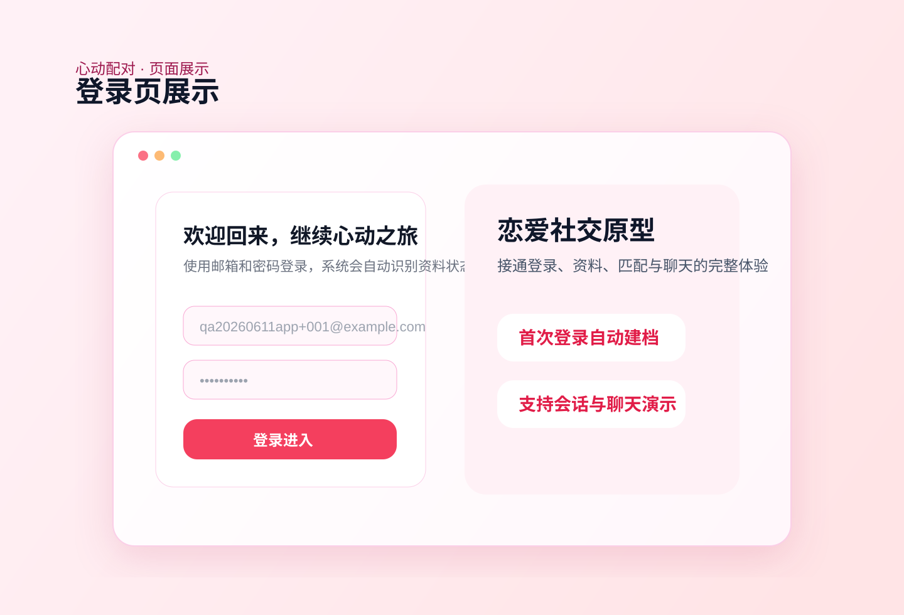
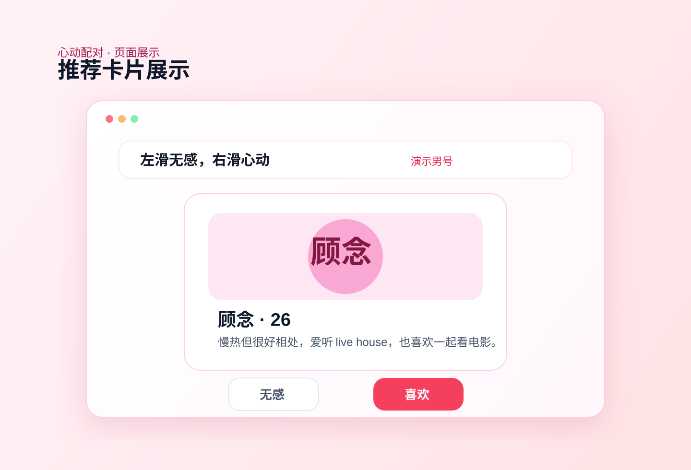
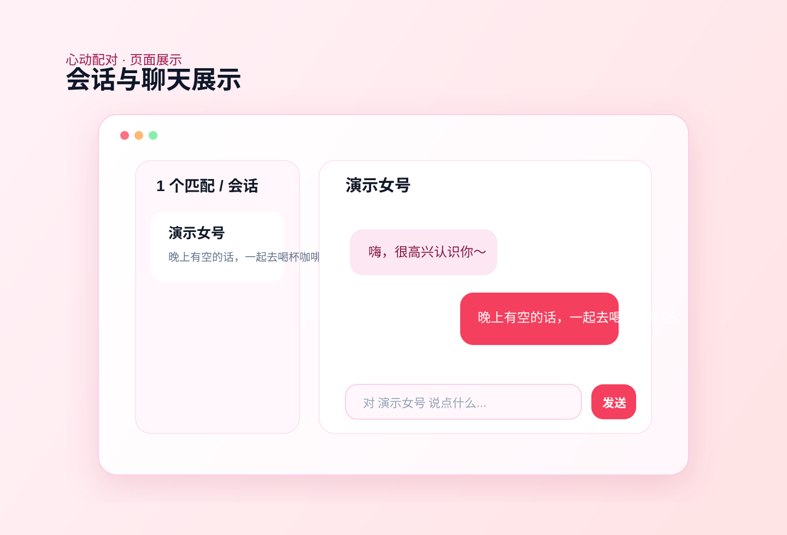

# 心动配对前端原型

这是一个基于 `Vite + React + Supabase` 的恋爱配对产品原型，已经打通了注册登录、资料完善、推荐卡片、双向匹配、会话列表、资料编辑和即时聊天的完整主链路。

## 项目亮点

- 完整恋爱产品主链路：登录、建档、推荐、匹配、聊天一条线打通
- 使用 `Supabase Auth + Database + Realtime`，不依赖自建后端即可演示
- 会话列表支持最新消息排序、未读数和已读状态
- 聊天支持 `Enter` 发送、`Shift + Enter` 换行、发送中临时气泡
- 登录后可随时编辑个人资料，变更会即时同步到当前界面
- 推荐卡片已做产品化打磨，适合项目展示、作业答辩或 Demo 演示

## 页面展示

### 登录页



### 推荐卡片页



### 会话与聊天页



## 当前功能

- 邮箱注册与登录
- 首次登录资料完善
- 将用户资料写入 `profiles`
- 推荐异性卡片并支持喜欢 / 无感
- 双向喜欢后自动创建 `matches`
- 匹配成功弹窗与聊天入口
- 会话列表与未读状态
- 同城寻缘雷达地图
- 浏览器定位写入 `profiles` 经纬度
- 5 公里范围异性用户地图打点
- 登录后资料编辑
- 基于 Supabase Realtime 的即时聊天

## 技术栈

- `React 19`
- `Vite 8`
- `Supabase Auth / Database / Realtime`
- `react-map-gl / mapbox-gl`
- `lucide-react`
- `canvas-confetti`

## 页面流程

```text
登录 / 注册
   ↓
首次资料完善
   ↓
推荐卡片页
   ↓
左右滑动 / 喜欢无感
   ↓
双向喜欢后自动匹配
   ↓
会话列表 / 聊天室
   ↓
资料编辑与持续互动
```

## 本地启动

1. 安装依赖

```bash
npm install
```

2. 配置环境变量

复制 `.env.example` 为 `.env`，并填入你自己的 Supabase 项目配置：

```bash
VITE_SUPABASE_URL=https://YOUR_PROJECT_REF.supabase.co
VITE_SUPABASE_ANON_KEY=YOUR_ANON_KEY
VITE_MAPBOX_TOKEN=YOUR_PUBLIC_MAPBOX_TOKEN
```

如果你要启用 `AI 红娘`，还需要在服务端环境中额外配置：

```bash
DEEPSEEK_API_KEY=YOUR_DEEPSEEK_API_KEY
```

3. 启动开发环境

```bash
npm run dev
```

4. 构建生产版本

```bash
npm run build
```

5. 本地预览构建结果

```bash
npm run preview
```

## 在线部署

仓库已补充 GitHub Pages 自动部署工作流：

- 工作流文件：`.github/workflows/deploy-pages.yml`
- 推送分支：`main`
- 部署方式：每次推送到 `main` 后自动构建并发布

默认线上地址会是：

`https://ruanzifeng518-art.github.io/my-dating-app/`

如果你刚刚第一次推送部署配置，通常需要等 GitHub Actions 跑完后，再过 1 到 3 分钟页面才会稳定可访问。

如果你要启用 `AI 红娘破冰` 这类需要服务端密钥的功能，推荐改为部署到 `Vercel`。仓库已经补了 `vercel.json` 和 `api/ai-matchmaker.js`，这样 `DeepSeek API Key` 可以安全放在服务端环境变量里，不会暴露到前端。

## 演示说明

如果你要拿这个项目做现场演示，当前已经有一套可直接使用的演示账号：

1. 男号：`qa20260611app+001@example.com` / `Test123456`
2. 女号：`qa20260611app+002@example.com` / `Test123456`

目前这两组账号已经在线验证过：

- 能正常登录
- 已建立匹配关系
- 会话列表可直接看到对方
- 女号发消息后，男号重新登录可看到最新消息

仓库里已经附带一份更详细的演示说明：

- `DEMO_GUIDE.md`：演示顺序、已验证测试账号、推荐演示话术与排查方式
- `PITCH_2MIN.md`：可直接用于答辩、面试或路演开场的 2 分钟讲稿
- `PITCH_5MIN.md`：可直接用于答辩、课程展示或项目汇报的 5 分钟完整版讲稿
- `PROJECT_CHEATSHEET.md`：答辩前 30 秒快速扫一眼的项目卖点速记卡
- `FINAL_DELIVERY_CHECKLIST.md`：最终交付清单，适合发老师、同学或面试官
- `VERCEL_AI_MATCHMAKER_DEPLOY.md`：`AI 红娘` 功能在 `Vercel` 上的逐步部署说明
- `MAP_RADAR_DEPLOY.md`：同城寻缘雷达地图的部署与定位说明
- `MAP_RADAR_QA.md`：同城雷达地图的上线前验收清单

## 数据库脚本

仓库内已经提供了初始化和功能补充所需的 SQL：

- `supabase_schema.sql`：基础表结构与示例数据
- `supabase_schema_fixed.sql`：更稳的可重复执行版本
- `supabase_schema_run.sql`：适合直接粘贴运行的版本
- `supabase_auth_policies.sql`：`profiles` 的自写入权限策略
- `supabase_likes_matches_flow.sql`：`likes / matches` 所需字段与策略
- `supabase_messages_realtime.sql`：`messages` 表与 Realtime 相关配置
- `supabase_location_radar.sql`：经纬度字段与同城雷达地图所需结构

推荐执行顺序：

1. `supabase_schema_run.sql` 或 `supabase_schema_fixed.sql`
2. `supabase_auth_policies.sql`
3. `supabase_likes_matches_flow.sql`
4. `supabase_messages_realtime.sql`
5. `supabase_location_radar.sql`

## 目录结构

```text
public/
  favicon.svg
  icons.svg

src/
  assets/           静态资源
  components/       页面与业务组件
  data/             示例数据
  utils/            前端状态工具
  App.jsx           应用主入口
  main.jsx          React 挂载入口
  index.css         全局样式
  supabaseClient.js Supabase 客户端
```

## 核心页面

- `src/components/Login.jsx`：登录 / 注册页
- `src/components/OnboardingFlow.jsx`：首次资料完善
- `src/components/MatchCardPage.jsx`：配对卡片页
- `src/components/MapRadar.jsx`：同城寻缘雷达地图
- `src/components/MatchSuccessModal.jsx`：匹配成功弹窗
- `src/components/MatchesDrawer.jsx`：会话列表抽屉
- `src/components/ChatRoom.jsx`：即时聊天室
- `src/components/ProfileEditorModal.jsx`：资料编辑弹层
- `src/utils/chatReadState.js`：会话已读状态记录

## 当前状态

已完成的主流程：

- 注册并登录
- 完善资料并写入数据库
- 浏览推荐卡片
- 点赞 / 无感写库
- 双向喜欢触发匹配
- 会话列表查看最近互动
- 进入聊天室
- 消息实时同步
- 打开雷达地图查看附近异性
- 点击地图头像直接发送心动
- 资料编辑并即时刷新显示

## 适合展示的能力

- 前端产品原型能力
- Supabase 集成能力
- 用户状态管理与页面切换能力
- 实时消息体验设计
- 从原型到可演示版本的产品打磨能力

## 后续可继续扩展

- 头像上传
- 图片消息 / 表情
- 举报 / 拉黑
- 推荐算法优化
- 更完整的用户搜索与筛选
- 更细的在线状态 / 已读回执
- 用户资料编辑
- 部署到 Vercel 或 Netlify
